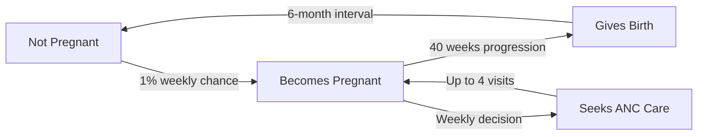
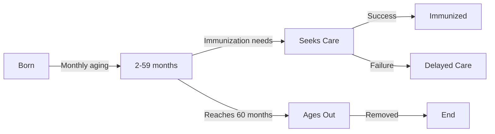
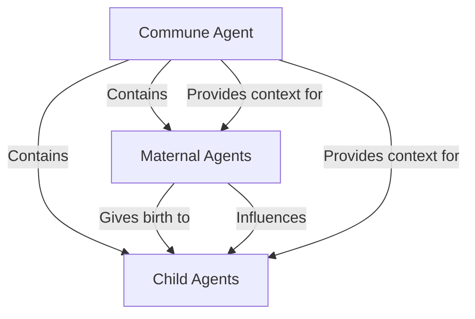
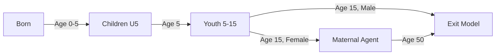

# Agent-Based Model Documentation: Vietnamese Maternal & Child Health System

## 📋 Model Overview

This Agent-Based Model (ABM) simulates maternal and child health access behaviors in **Dien Bien Province, Vietnam**. The model includes four main agent types that interact to represent the complex dynamics of rural healthcare access and intervention effectiveness.

**Simulation Period:** 6 years (2019-2024)  
**Geographic Coverage:** 125 communes across 10 districts in Dien Bien Province  
**Population:** Based on real Vietnamese demographic data

---

## 🏘️ Agent Type 1: Commune

**Purpose:** Represents administrative and geographic units that provide environmental context for health behaviors.

### **Characteristics:**
```yaml
Core Attributes:
  - commune_name: String (actual commune name from data)
  - district_name: String (parent administrative unit)
  - total_population: Integer (2019 census data)
  - women_15_49: Integer (women of reproductive age)
  - children_under_5: Integer (pediatric population)

Infrastructure Attributes:
  - poverty_rate: Float (0.3-0.8) - Random between 30-80%
  - literacy_rate: Float (0.6-0.9) - Random between 60-90%
  - distance_to_hospital: Float (2.0-20.0 km) - Distance to nearest major facility

Visual Representation:
  - Color: Gray
  - Size: Proportional to total_population/1000
  - Shape: Circle with black border
```

### **Behaviors:**
1. **Agent Initialization:** Creates maternal and child agents based on demographic data
2. **Ethnicity Sampling:** Assigns ethnic groups based on Dien Bien demographics:
   - Thai: 40%
   - Kinh: 20% 
   - Hmong: 20%
   - Other: 20%
3. **Socioeconomic Assignment:** Generates individual-level poverty and literacy based on commune characteristics

### **Data Sources:**
- Real demographic data from Vietnamese census (2019-2024)
- 770 data records covering 125 communes
- Administrative hierarchy: Province → District → Commune

---

## 👩‍🍼 Agent Type 2: Maternal Agent

**Purpose:** Represents women of reproductive age (15-49) with pregnancy and care-seeking behaviors.

### **Characteristics:**
```yaml
Demographics:
  - age: Integer (15-49 years)
  - ethnicity: String (Thai/Kinh/Hmong/Other)
  - literacy_level: Float (0.0-1.0)
  - poverty_level: Float (0.0-1.0)
  - mobile_access: Boolean (60% probability)
  - distance_to_facility: Float (commune distance ± 2km variation)

Health Status:
  - is_pregnant: Boolean (false by default)
  - weeks_pregnant: Integer (0-40+ weeks)
  - anc_visits: Integer (0-4+ visits)
  - anc_target: Integer (4 visits - WHO recommendation)
  - has_skilled_birth_attendant: Boolean
  - weeks_since_last_birth: Integer (for birth spacing)

Intervention Engagement:
  - app_engagement: Float (0.0-1.0) - Digital health app usage
  - received_sms: Boolean - SMS reminder participation
  - chw_contacted: Boolean - Community health worker visit

Behavioral Parameters:
  - care_seeking_threshold: Float (0.1-0.9) - Propensity to seek care
  - base_pregnancy_rate: 1% weekly probability
```

### **Behaviors:**

#### **1. Pregnancy Cycle:**


#### **2. Care-Seeking Decision Process:**
```yaml
ANC Care Probability Calculation:
  Base Probability: 0.1 + 0.02 × weeks_pregnant (max 0.8)
  
  Positive Factors:
    - Higher literacy: -0.2 × literacy_level (threshold reduction)
    - App engagement: +0.2 if engagement > 0.5
    - SMS reminders: +0.15 if received_sms = true
    - CHW contact: +0.25 if chw_contacted = true
    - Financial incentives: +0.3 if poverty > 0.6
  
  Negative Factors:
    - Higher poverty: +0.15 × poverty_level (threshold increase)
    - Greater distance: +0.1 × min(distance/10, 0.3)
    - Non-Kinh ethnicity: +0.1 (cultural barriers)
```

#### **3. Birth Outcomes:**
```yaml
Skilled Birth Attendant Probability:
  Base: 0.4 + 0.1 × anc_visits
  Literacy boost: +0.2 × literacy_level
  Poverty penalty: -0.15 × poverty_level
  Distance penalty: -0.05 × min(distance/5, 0.4)
  Final range: 0.1 to 0.95
```

### **Visual Representation:**
- **Pregnant:** Red circle (radius 0.5)
- **Non-pregnant:** Blue circle (radius 0.5)

---

## 👶 Agent Type 3: Child Agent

**Purpose:** Represents children under 5 years with immunization and health-seeking behaviors.

### **Characteristics:**
```yaml
Demographics:
  - age_months: Integer (0-59 months)
  - mother_agent: Reference to MaternalAgent
  - my_commune: Reference to Commune

Health Status:
  - immunizations_received: Integer (0-8)
  - immunizations_target: Integer (8 - full schedule)
  - care_seeking_delays: Integer (missed opportunities)

Aging Process:
  - Ages 1 month every 4 simulation weeks
  - Removed from simulation at 60 months (5 years)
```

### **Behaviors:**

#### **1. Immunization Schedule:**
```yaml
Expected Immunizations by Age:
  - 2 months: 1 immunization
  - 4 months: 2 immunizations  
  - 6 months: 3 immunizations
  - 12 months: 6 immunizations
  - 18 months: 8 immunizations (complete)

Decision Process:
  Base probability: 0.3
  Mother's literacy boost: +0.2 × literacy_level
  Poverty penalty: -0.1 × poverty_level
  App intervention: +0.15 if mother app_engagement > 0.4
  Incentive boost: +0.25 if mother poverty_level > 0.5
```

#### **2. Lifecycle Flow:**


### **Visual Representation:**
- **Fully Immunized:** Green circle (radius 0.3)
- **Needs Immunization:** Orange circle (radius 0.3)

---

## 🎯 Agent Interactions & Data Flow

### **Spatial Relationships:**


### **Temporal Dynamics:**
```yaml
Weekly Cycle (Every Simulation Step):
  1. Maternal agents age pregnancy (if pregnant)
  2. Pregnancy care-seeking decisions
  3. Birth events (at 40 weeks)
  4. New pregnancy possibilities
  5. Child aging (monthly intervals)
  6. Child immunization decisions
  7. Intervention effects applied

Annual Cycle (Every 52 weeks):
  - Year counter incremented
  - Population demographic updates
  - Long-term trend analysis
```

### **Intervention Effects:**

#### **App-Based Intervention:**
- **Target:** Maternal agents with mobile_access = true
- **Effect:** Increases app_engagement (0.1-0.3 increment)
- **Impact:** +20% ANC care probability when engagement > 0.5

#### **SMS Outreach:**
- **Target:** Maternal agents with mobile_access = true
- **Effect:** Sets received_sms = true
- **Impact:** +15% ANC care probability

#### **CHW Visits:**
- **Target:** High-priority mothers (pregnant or high poverty)
- **Effect:** Sets chw_contacted = true (max 10 visits/week)
- **Impact:** +25% ANC care probability

#### **Financial Incentives:**
- **Target:** High-poverty families (poverty_level > 0.5-0.6)
- **Impact:** +30% ANC probability, +25% child immunization probability

---

## 📊 Key Performance Indicators

### **Population-Level Metrics:**
```yaml
Health Coverage:
  - ANC Coverage: % of pregnant women with ≥4 visits
  - Skilled Birth Rate: % of births with trained attendant
  - Immunization Rate: % of children fully vaccinated by age
  
Access Equity:
  - Geographic disparities between communes
  - Ethnic group health differences
  - Poverty-related access gaps
  
Intervention Effectiveness:
  - Digital engagement rates
  - Care-seeking behavior changes
  - Population health improvements
```

### **Agent-Level Tracking:**
```yaml
Individual Behaviors:
  - Pregnancy cycles and spacing
  - Healthcare utilization patterns
  - Response to interventions
  
System Dynamics:
  - Agent population changes over time
  - Spatial clustering of health behaviors
  - Emergence of health disparities
```

---

## 🔄 Model Validation

### **Data Validation:**
- **Demographic accuracy:** Real Vietnamese census data (770 records)
- **Geographic coverage:** 125 communes, 10 districts
- **Population structure:** Age/sex distributions match national patterns

### **Behavioral Validation:**
- **Care-seeking patterns:** Based on Vietnamese health surveys
- **Cultural factors:** Ethnicity effects from literature
- **Economic barriers:** Poverty impacts from empirical studies

### **System Validation:**
- **Health system capacity:** Realistic facility constraints
- **Intervention effects:** Evidence-based impact estimates
- **Temporal patterns:** Seasonal and lifecycle variations

---

## 🎯 Model Applications

### **Policy Questions Addressed:**
1. **Which interventions are most cost-effective?**
2. **How to reduce geographic health disparities?**
3. **What's the optimal intervention targeting strategy?**
4. **How do cultural factors affect intervention effectiveness?**

### **Scenario Testing:**
- **Baseline:** Current system performance
- **Digital Scale-up:** App + SMS interventions
- **Equity Focus:** CHW + Incentive programs
- **Comprehensive:** All interventions combined

### **Scaling Potential:**
- **District → Provincial:** Typology-based scaling
- **Provincial → National:** Multi-province comparison
- **Policy → Practice:** Real-world pilot design

---

## 📚 Technical Implementation

### **Platform:** GAMA 1.9.2+
### **Data Format:** CSV demographic files
### **Output:** Real-time dashboards, time-series data, spatial visualizations
### **Performance:** Optimized with 10% population sampling for responsiveness

---

## 📋 Current Model Features

### **Population Flow System**


### **Age Distribution**
- **Maternal agents**: Gaussian distribution centered at 27 years (σ=6)
- **Child agents**: Gaussian distribution centered at 30 months (σ=18)
- **Natural aging**: Monthly progression with lifecycle transitions

### **Population Parameters**
```yaml
Pregnancy rate: 0.15% weekly
Birth spacing: Minimum 52 weeks
Max children: 3 per mother
Child transitions: Ages 5 and 15
Maternal exit: Age 50
```

### **Monitoring System**
- Real-time population tracking with dead agent exclusion
- Transition flow monitoring (births, aging, exits)
- Health outcome metrics (ANC, immunization, births)
- Intervention effectiveness tracking

### **File Structure**
- **Primary**: `CEI-Simulation/models/dien-bien-abm.gaml`
- **Parallel**: `CEI-Simulation/models/thai-nguyen-abm.gaml`
- Both models use identical logic with province-specific parameters

---

**This ABM represents a comprehensive digital laboratory for Vietnamese health policy experimentation, combining real demographic data with evidence-based behavioral modeling to support data-driven health system planning.** 🇻🇳 